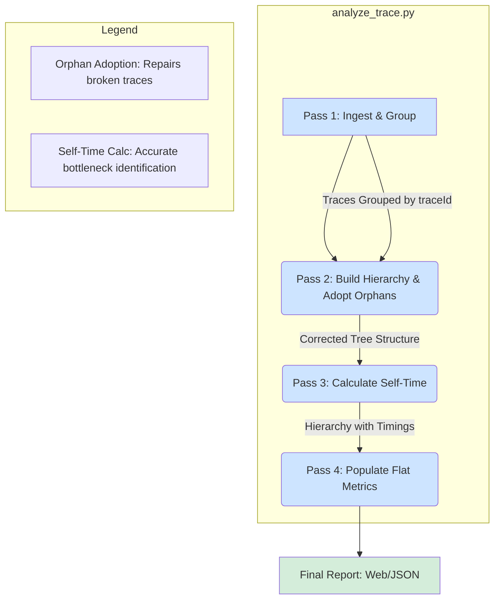

# Analysis Summary: Trace Analyzer vs. Jaeger/Grafana

This document outlines the key benefits of the Trace Analyzer project when compared to traditional real-time trace viewing tools like Jaeger or Grafana. The analysis is based on a review of the project's code, documentation, and architecture.

The fundamental difference is one of purpose:
- **Jaeger/Grafana:** Real-time observability platforms designed for live monitoring, exploration of individual traces, and visualizing system topology. They excel at answering "What is happening right now?" or "Show me the full trace for this specific failed request."
- **Trace Analyzer:** An offline, batch-processing tool designed for deep, aggregated analysis of a captured set of traces. It excels at answering "What are the most significant performance bottlenecks across thousands of requests?"

## Key Benefits

### 1. High-Level Aggregation and Sophisticated Endpoint Normalization

This is the most significant benefit. While Jaeger can show individual requests, it often struggles with high-cardinality endpoints, treating `/api/users/123` and `/api/users/456` as distinct operations.

- **How Trace Analyzer is Different:** The `normalize_path` function in [`analyze_trace.py`](analyze_trace.py:41) uses multiple regular expressions to intelligently group similar endpoints. It normalizes UUIDs, numeric IDs, and even application-specific identifiers (e.g., `AppName__ResourceName`) into placeholders like `{uuid}` and `{id}`.
- **Benefit:** This provides a clean, high-level, and actionable view of performance. Instead of a noisy list of thousands of unique URLs, you get a concise report showing the aggregated performance (total time, count, average time) for endpoint *patterns*. This makes it far easier to identify systemic issues with a particular type of operation.

### 2. Accurate `Self-Time` Calculation at Scale

Understanding the time a function spends executing its own logic, excluding time spent in downstream calls (`self-time`), is critical for pinpointing bottlenecks.

- **How Trace Analyzer is Different:** The architecture is explicitly designed to calculate this accurately. The "four-pass system" described in [`architecture_summary.md`](architecture_summary.md:27) first builds a complete and corrected trace hierarchy (including "adopting" orphaned spans) and *then* performs a recursive, bottom-up calculation (`_calculate_hierarchy_timings`) to determine the `self_time` for every single span. This value is then aggregated in the final report.
- **Benefit:** While Jaeger's timeline view implies self-time, this tool calculates and **aggregates** it across all processed traces. The final report, sorted by "Total Time", immediately highlights the functions and endpoints where the most time is being spent *in the functions themselves*, providing a clear signal for optimization efforts.

### 3. Offline, In-Depth, and Portable Analysis

Jaeger and Grafana require a persistent, complex infrastructure to operate.

- **How Trace Analyzer is Different:** It is a lightweight, portable Python application that runs on a single JSON file. It can be run locally via `pip` or a simple `docker` command. The output is a self-contained HTML or JSON file.
- **Benefit:** This makes it ideal for:
    - **Post-Incident Reviews:** Analyze a snapshot of traces from the time of an incident without needing access to the live system.
    - **Performance Benchmarking:** Compare reports from before and after a code change to quantify its impact.
    - **Easy Collaboration:** Share a single, interactive HTML report with team members, which is much simpler than sharing links to a live Jaeger instance and ensuring the time windows are correct.

### 4. Focused Reporting on Service Interactions and Messaging

- **How Trace Analyzer is Different:** The tool generates specific, quantitative reports on service-to-service calls and Kafka messaging operations.
    - **Service Calls:** It distinguishes incoming vs. outgoing calls and presents a table of `caller → callee` interactions, including which endpoints were called, the frequency, and the total time spent.
    - **Kafka/Messaging:** It elevates messaging to a first-class citizen, providing a dedicated section that aggregates performance metrics for `producer` and `consumer` operations.
- **Benefit:** This is more direct and actionable than a generic service map. It provides a quantitative summary of inter-service dependencies and messaging performance, making it easy to spot chatty interactions or slow message handlers.

### 5. Intelligent Filtering for Service Mesh Environments

Modern microservices often run on service mesh platforms like Istio or Envoy, which inject sidecar proxies that create duplicate spans for the same logical operation (e.g., both the application's span and the Envoy proxy's span). This can pollute trace analysis with infrastructure noise.

- **How Trace Analyzer is Different:** The tool provides **configurable filtering** with three independent controls:
    - **Strip Query Parameters** (default: on) - Groups similar endpoints by removing query strings
    - **Include Gateway Services** (default: off) - Controls whether to show API gateways and proxies that only have CLIENT spans
    - **Include Service Mesh** (default: off) - Controls whether to show Istio/Envoy sidecar spans (SERVER→SERVER and CLIENT→CLIENT chains)

- **Benefit:** Users can choose their level of detail:
    - **Business Logic Only** (defaults) - Clean view showing only application spans, ideal for performance analysis
    - **+ Gateways** - Includes API gateways and load balancers without sidecar noise
    - **+ Service Mesh** - Shows complete infrastructure including sidecar overhead, useful for diagnosing mesh issues
    - **Complete View** - Everything included for comprehensive debugging

  This flexibility is especially valuable in Kubernetes environments with Istio/Envoy where raw traces contain significant infrastructure duplication. Jaeger shows everything without smart filtering, making it harder to focus on application-level bottlenecks.

## Architecture Highlight: The Four-Pass Analysis Pipeline

The core of the tool's unique value lies in its processing pipeline, which ensures data integrity and accurate calculations.

## Conclusion

The Trace Analyzer is not a replacement for Jaeger or Grafana. It is a complementary tool that serves a different purpose. It trades real-time visibility for deep, aggregated, and portable offline analysis. Its key strengths are the intelligent normalization of endpoints, the accurate calculation of aggregated self-time, and its focused, actionable reports, making it a powerful asset for performance engineering and post-incident analysis.