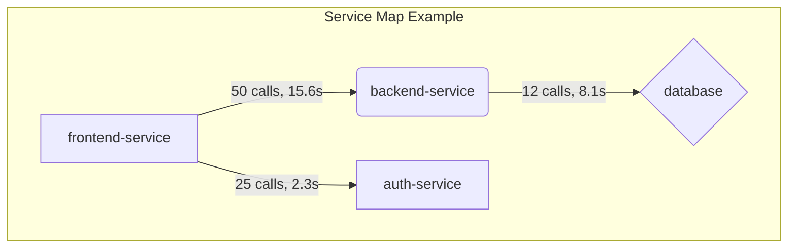

# Proposed Improvements for Trace Analyzer

Based on the initial analysis, the Trace Analyzer is a powerful tool for offline trace analysis. Here are several proposed improvements, categorized into three main areas, that could enhance its functionality, user experience, and overall value.

---

## 1. Core Engine Enhancements (`analyze_trace.py`)

These improvements focus on expanding the depth and breadth of the analysis itself.

### 1.1. Statistical Latency Analysis (P50/P90/P99)
- **What:** For each aggregated endpoint, calculate not just the total and average time, but also key latency percentiles (e.g., p50, p90, p95, p99).
- **Why:** Average time can be misleading and hide outliers. Percentiles provide a much clearer picture of the user experience. A p99 latency of 3 seconds is a critical piece of information, even if the average is 200ms. This is standard practice in modern APM tools.

### 1.2. First-Class Error Analysis
- **What:** Explicitly detect and aggregate spans that have an "error" status. The report should include a new section detailing errors by service and endpoint, including error counts and common error messages.
- **Why:** The current analysis is performance-focused. Adding error analysis would provide a more complete picture of system health, making the tool valuable for reliability engineering, not just performance tuning.

### 1.3. Support for More Protocols
- **What:** Extend the analyzer to recognize and parse other common protocols, such as **gRPC** and **database calls** (e.g., SQL queries from JDBC/ODBC spans).
- **Why:** Modern systems are not just HTTP and Kafka. Adding support for gRPC and databases would dramatically increase the tool's applicability and allow for true end-to-end analysis that includes the data layer.

### 1.4. Report Comparison / Diffing
- **What:** Add a new mode or tool that can take two analysis reports (e.g., `before.json` and `after.json`) and generate a "diff." This diff would highlight performance regressions or improvements between the two runs.
- **Why:** This would be a killer feature for CI/CD integration and release validation. It provides a concrete, data-driven way to answer the question, "Did my latest deployment make performance better or worse?"

---

## 2. UI/UX Improvements (`app.py` & `templates/`)

These improvements focus on making the data more accessible, interactive, and easier to understand.

### 2.1. Interactive Visualizations and Charts
- **What:** Replace or augment the text-heavy tables with interactive charts.
  - A **bar chart** showing the "Top 10 Slowest Endpoints by Total Time."
  - A **service map** (using a library like Mermaid.js or a more dynamic one like D3.js) to visually represent the `caller → callee` relationships.
  - **Sparklines** next to each endpoint showing the latency distribution.
- **Why:** Visualizations make complex data instantly digestible. A service map is far more intuitive for understanding system architecture than a table of calls.

### 2.2. Dynamic Filtering and Searching
- **What:** Add client-side controls to the results page to dynamically filter the tables and charts by service name, endpoint, or other attributes. A search bar would also be highly effective.
- **Why:** For large traces with dozens of services, the current report can be overwhelming. Dynamic filtering would allow users to quickly drill down to the specific service or endpoint they care about, dramatically improving usability.

### 2.3. Asynchronous Analysis for Large Files
- **What:** For the web UI, change the file upload to trigger a background job (using a library like Celery or RQ). The UI would then either poll for completion or use a WebSocket to notify the user when the report is ready.
- **Why:** The current implementation blocks the HTTP request during analysis, which will time out for very large files. Asynchronous processing is essential for making the web UI robust and scalable for real-world use cases.

---

## 3. Architectural & Feature Enhancements

These are larger-scale changes that could open up new possibilities for the tool.

### 3.1. Configurable Normalization Rules
- **What:** Move the URL normalization regex patterns from being hardcoded in [`analyze_trace.py`](analyze_trace.py) to a configuration file (e.g., `rules.yaml`) or allow them to be specified in the UI.
- **Why:** Different organizations have different URL structures and identifier patterns. Allowing users to define their own rules would make the tool far more flexible and adaptable to different environments without requiring code changes.

### 3.2. Plugin Architecture for Analyzers
- **What:** Refactor the core analysis loop to support a plugin-style architecture. Users could write their own "protocol analyzers" (e.g., for a proprietary RPC framework) that conform to a specific interface and register them with the main application.
- **Why:** This would make the tool extensible and future-proof. The community or internal teams could add support for any protocol without needing to modify the core codebase, fostering a more vibrant ecosystem around the tool.